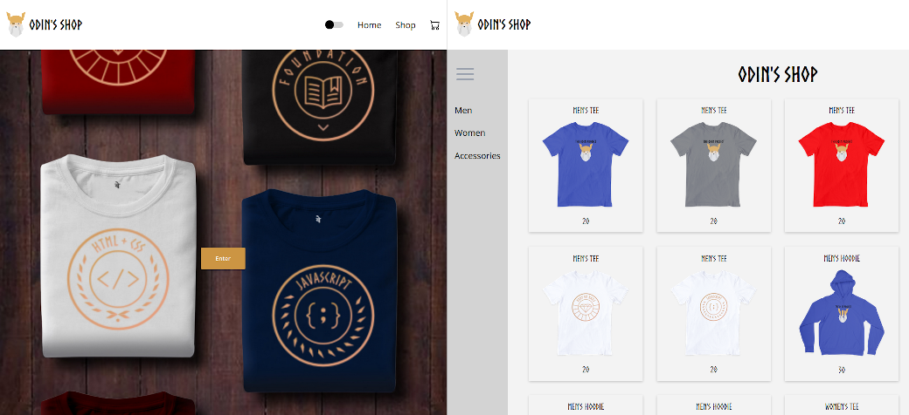

# Odin's Shop

============

My take on a merch store for TheOdinProject.com

---

## Features
- Page routing
- Size select
- Item quantity counter
- Item click to zoom
- Cart quantity counter
- Can delete items from cart
- Cart total is tracked and displayed
- Light/dark mode toggle
- Semi-collapsible sidebar
- Mobile responsive
- Mobile sidebar with nifty close tab
## Built With
- React
- React Icons
- React Testing Library
- Vanilla CSS
- GNU Image Manipulation Program
## Concepts / Things I learned
- React Router in general
  - Using MemoryRouter
- React Testing in general
  - Using test ids
  - Testing click events
  - Using mock functions
- Using CSS variables/theming with data attributes
- Working with select menus in React
- Form validation for the quantity counter
- Image editing
- Working with mockups
---